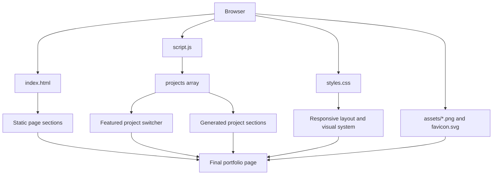
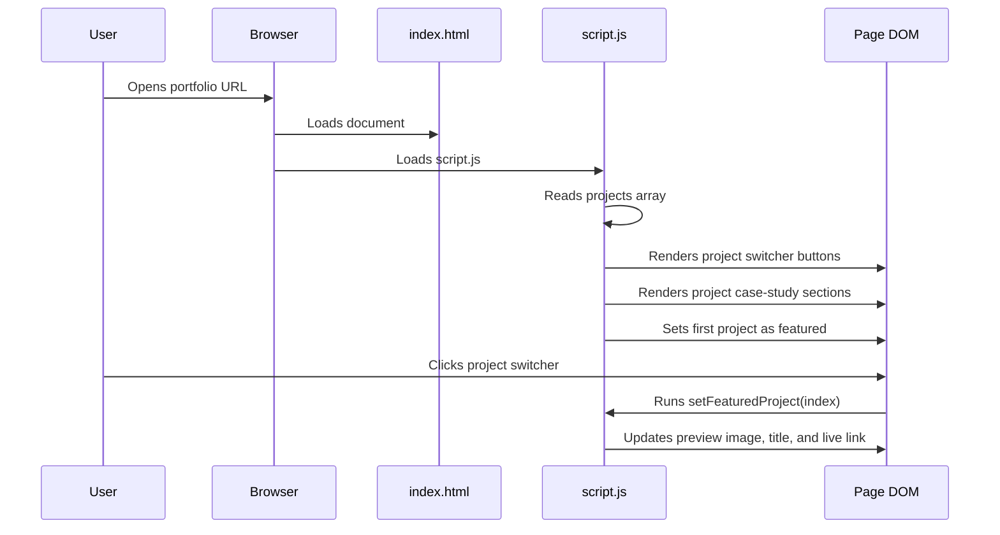

# Moslem Ajra Portfolio Website

A static, product-minded portfolio website for **Moslem Ajra**.

The site presents live web projects with a bold editorial visual style, a featured project preview, and case-study style project sections. It is intentionally built with plain HTML, CSS, and JavaScript so it stays simple to deploy, easy to inspect, and easy to extend as new projects are added.

## Table of Contents

- [Project Purpose](#project-purpose)
- [Current Live Projects](#current-live-projects)
- [Feature Overview](#feature-overview)
- [Tech Stack](#tech-stack)
- [Folder Structure](#folder-structure)
- [How the Site Works](#how-the-site-works)
- [Architecture Diagram](#architecture-diagram)
- [Runtime Flow](#runtime-flow)
- [Project Data Model](#project-data-model)
- [How to Run Locally](#how-to-run-locally)
- [How to Edit the Portfolio](#how-to-edit-the-portfolio)
- [How to Add a New Project](#how-to-add-a-new-project)
- [How to Update Screenshots](#how-to-update-screenshots)
- [Design System Notes](#design-system-notes)
- [Accessibility Notes](#accessibility-notes)
- [SEO Notes](#seo-notes)
- [Testing and Verification Checklist](#testing-and-verification-checklist)
- [Deployment](#deployment)
- [Known Limitations](#known-limitations)
- [Recommended Next Improvements](#recommended-next-improvements)
- [Content Template for Future Case Studies](#content-template-for-future-case-studies)
- [Maintenance Guidelines](#maintenance-guidelines)
- [Owner](#owner)

## Project Purpose

This portfolio is designed to do more than list links. Its job is to help a visitor quickly understand:

- who Moslem Ajra is
- what kind of work he builds
- which projects are live
- what each project does
- what UX/product thinking went into each project
- how to contact him

The strongest portfolio pages do not only show screenshots. They explain the product, the problem, the decisions, and the next improvement path. This site follows that direction.

## Current Live Projects

The portfolio currently includes two live projects:

| Project | Type | Live URL |
| --- | --- | --- |
| Zakn | Business validation platform | <https://zakintest-c7j3qezy.manus.space/> |
| Recipe Assistant Pro | Recipe discovery app | <https://recipe-assistant-pro.vercel.app/> |

More projects can be added later through the `projects` array in `script.js`.

## Feature Overview

The site currently includes:

- sticky header with name and navigation
- bold hero section with clear positioning
- live project preview panel
- project switcher for the featured preview
- marquee-style focus strip
- generated project case-study sections
- contact section with email, phone, GitHub, and LinkedIn
- responsive layout for desktop and mobile
- custom SVG favicon
- static assets for project screenshots

## Tech Stack

This project uses:

- **HTML** for page structure
- **CSS** for layout, responsive design, visual system, and interactions
- **JavaScript** for project data rendering and the featured project switcher
- **Static image assets** for project previews

There is no framework, build step, dependency manager, bundler, or backend server.

That is intentional. For this project size, plain static files are simpler, faster to deploy, and easier to maintain.

## Folder Structure

```text
.
├── README.md
├── assets
│   ├── recipe-assistant.png
│   └── zakn.png
├── favicon.svg
├── index.html
├── script.js
└── styles.css
```

### File Responsibilities

| File | Responsibility |
| --- | --- |
| `index.html` | Defines the static page structure, sections, navigation, contact area, and script/style links. |
| `styles.css` | Controls all visual design, layout, responsiveness, spacing, typography, and interaction styles. |
| `script.js` | Stores project content and renders the project preview switcher and project case-study sections. |
| `assets/zakn.png` | Screenshot used for the Zakn project preview and case study. |
| `assets/recipe-assistant.png` | Screenshot used for the Recipe Assistant Pro project preview and case study. |
| `favicon.svg` | Browser favicon for the portfolio. |
| `README.md` | Project documentation. |

## How the Site Works

The static HTML contains the permanent page sections:

- header
- hero section
- featured project preview shell
- work section container
- method section
- about/positioning section
- contact section
- footer

The project-specific content is not duplicated in `index.html`. Instead, it lives in one array inside `script.js`.

At runtime, JavaScript:

1. Reads the `projects` array.
2. Creates switcher buttons for each project.
3. Creates full project case-study sections.
4. Sets the first project as the featured preview.
5. Updates the footer year automatically.

This keeps the page easier to maintain. When a new project is added, the main layout does not need to be rewritten.

## Architecture Diagram



The diagram shows that the browser loads four types of resources: HTML, CSS, JavaScript, and assets. The HTML provides the page skeleton, CSS provides presentation, JavaScript injects project-specific content, and assets provide real project visuals.

## Runtime Flow



The flow is simple: the page loads, JavaScript renders project content, and the user can switch the featured preview without leaving the page.

## Project Data Model

Projects are defined in `script.js`:

```js
const projects = [
  {
    title: "Zakn",
    type: "Business validation platform",
    image: "assets/zakn.png",
    alt: "Zakn Arabic landing page screenshot with a dark hero and green call to action",
    summary:
      "An Arabic web product that helps founders test a business idea before spending heavily on it.",
    challenge:
      "Explain a serious business service quickly, build trust, and make the first action obvious.",
    uxMove:
      "Strong promise, direct call to action, Arabic-first layout, and a landing page that focuses on decision confidence.",
    next:
      "Turn this into a case study with funnel goals, conversion copy tests, and a cleaner before/after story.",
    tags: ["Arabic UX", "Landing page", "Founder tools", "Market validation"],
    liveUrl: "https://zakintest-c7j3qezy.manus.space/",
  },
];
```

### Field Reference

| Field | Type | Required | Purpose |
| --- | --- | --- | --- |
| `title` | string | Yes | Project name displayed in the switcher and case section. |
| `type` | string | Yes | Short project category, such as `Recipe discovery app`. |
| `image` | string | Yes | Path to the screenshot used in the preview and case section. |
| `alt` | string | Yes | Accessible image description for screen readers. |
| `summary` | string | Yes | Short explanation of what the project is. |
| `challenge` | string | Yes | The main product, UX, or technical challenge. |
| `uxMove` | string | Yes | The design or UX decision that improves the project. |
| `next` | string | Yes | Honest next improvement or future case-study angle. |
| `tags` | string[] | Yes | Tags displayed as visual chips. |
| `liveUrl` | string | Yes | URL used by the live project link. |

## How to Run Locally

From the project root:

```bash
python3 -m http.server 8000
```

Then open:

```text
http://localhost:8000
```

You can also open `index.html` directly in a browser, but using a local server is closer to how the site behaves after deployment.

## How to Edit the Portfolio

### Update Contact Information

Contact links are in `index.html`, inside the `contact-section`:

```html
<a class="button button-dark" href="mailto:ajra.new.era@gmail.com">ajra.new.era@gmail.com</a>
<a class="text-link" href="tel:+21625443465">+216 25 443 465</a>
<a class="text-link" href="https://github.com/moslemajra85">GitHub</a>
<a class="text-link" href="https://www.linkedin.com/in/moslem-ajra">LinkedIn</a>
```

Current contact details:

- Email: `ajra.new.era@gmail.com`
- Phone: `+216 25 443 465`
- LinkedIn: <https://www.linkedin.com/in/moslem-ajra>
- GitHub: <https://github.com/moslemajra85>

### Update Hero Copy

Hero text lives in `index.html`, inside:

```html
<section class="hero">
```

The most important hero elements are:

- eyebrow: `Product-minded web developer`
- headline: `I build web apps that feel obvious from the first click.`
- supporting paragraph
- primary and secondary calls to action

Keep the hero clear and specific. Avoid generic claims like "passionate developer" unless they are backed by proof.

### Update Method Section

The method section explains how the portfolio should be judged:

- show the product fast
- make the role visible
- keep the structure scalable

This section is useful because it tells visitors how to read the work. If the portfolio later becomes more technical, this section can evolve into engineering principles.

## How to Add a New Project

1. Add a screenshot to the `assets` folder.
2. Add a new object to the `projects` array in `script.js`.
3. Fill in every field.
4. Check the rendered page on desktop and mobile.
5. Verify the live link opens in a new tab.

Example:

```js
{
  title: "Project Name",
  type: "Project category",
  image: "assets/project-name.png",
  alt: "Screenshot description that explains what is visible",
  summary: "One or two sentences explaining what the project does.",
  challenge: "The main product, UX, or technical problem.",
  uxMove: "The decision that makes the project easier or better for users.",
  next: "The most honest next improvement.",
  tags: ["Tag one", "Tag two", "Tag three"],
  liveUrl: "https://example.com/",
}
```

### Content Quality Rules

Good project writing should be:

- specific
- honest
- user-focused
- short enough to scan
- clear about your role or thinking

Weak project writing sounds like:

- "Modern and responsive app"
- "Built with latest technologies"
- "Beautiful UI"
- "Full-stack project"

Those phrases are too generic. Stronger writing explains what the app does and what decision made it better.

## How to Update Screenshots

Screenshots currently live in:

```text
assets/zakn.png
assets/recipe-assistant.png
```

Recommended screenshot rules:

- Use a desktop viewport around `1440x1000`.
- Capture the top of the project page.
- Make sure important UI is visible.
- Avoid screenshots showing loading skeletons.
- Keep filenames lowercase and descriptive.
- Use `.png` or `.webp`.

If using Chrome from the command line:

```bash
google-chrome --headless --disable-gpu --no-sandbox \
  --screenshot=assets/project-name.png \
  --window-size=1440,1000 \
  https://example.com/
```

After updating screenshots, refresh the local site and verify image cropping in:

- hero preview
- project case section
- mobile layout

## Design System Notes

The current visual direction is intentionally bold:

- off-white grid background
- black bordered panels
- heavy drop shadows
- strong black typography
- acid green accent color
- case-study style project cards

This makes the portfolio feel more distinctive than a generic developer template.

### Main CSS Variables

Defined in `styles.css`:

```css
:root {
  --ink: #101010;
  --muted: #5d625f;
  --paper: #f6f8f2;
  --panel: #ffffff;
  --line: #d8ded3;
  --acid: #c9ff2f;
  --acid-2: #7cffd4;
  --black: #050505;
  --shadow: 0 24px 70px rgba(16, 16, 16, 0.14);
}
```

### Layout Strategy

The layout uses:

- CSS Grid for major page sections
- Flexbox for button groups and contact links
- media queries for tablet and mobile layouts
- consistent border and shadow treatment for visual identity

### Responsive Breakpoints

The main breakpoints are:

| Breakpoint | Purpose |
| --- | --- |
| `900px` | Switches major two-column sections into one-column layouts. |
| `560px` | Tightens mobile spacing, shadow sizes, nav layout, and button width. |

## Accessibility Notes

Current accessibility considerations:

- semantic `header`, `main`, `section`, `nav`, and `footer`
- `aria-label` for navigation and interactive project switcher
- descriptive `alt` text for project screenshots
- keyboard focus styles through `:focus-visible`
- buttons use real `<button>` elements for preview switching
- external links include `rel="noreferrer"`
- phone number uses a `tel:` link
- email uses a `mailto:` link

Accessibility improvements to consider later:

- add `aria-current` or `aria-pressed` to active project switcher buttons
- reduce motion if future animations are added
- test with a screen reader
- check color contrast after any theme changes

## SEO Notes

Current SEO basics:

- descriptive page title
- meta description
- semantic HTML structure
- real project names and descriptions in rendered content
- favicon

Potential SEO improvements:

- add Open Graph tags for social previews
- add a dedicated preview image
- add `Person` structured data for Moslem Ajra
- add canonical URL once the final domain is known
- add individual project case-study pages for indexable long-form content

## Testing and Verification Checklist

Before publishing changes, check:

- page loads at `http://localhost:8000`
- no browser console errors
- header links scroll to the correct sections
- featured project switcher changes the screenshot, title, and live link
- every live project link opens correctly
- email link opens an email client
- phone link is formatted correctly
- GitHub and LinkedIn open correctly
- screenshots are not broken
- desktop layout does not overflow horizontally
- mobile layout does not clip text
- buttons are large enough to tap on mobile
- project descriptions are specific and truthful
- no placeholder text remains

Recommended browser sizes:

| Viewport | Purpose |
| --- | --- |
| `1440x1100` | Desktop layout and hero balance. |
| `390x1200` | Mobile layout and tap targets. |
| `1440x2600` | Long-page project section review. |

Example screenshot verification commands:

```bash
google-chrome --headless --disable-gpu --no-sandbox \
  --screenshot=/tmp/portfolio-desktop.png \
  --window-size=1440,1100 \
  http://localhost:8000

google-chrome --headless --disable-gpu --no-sandbox \
  --screenshot=/tmp/portfolio-mobile.png \
  --window-size=390,1200 \
  http://localhost:8000
```

## Deployment

Because this is a static site, it can be deployed almost anywhere.

Good deployment options:

- GitHub Pages
- Netlify
- Vercel
- Cloudflare Pages
- any static hosting service

### Deploying to GitHub Pages

1. Push the project to a GitHub repository.
2. Go to repository settings.
3. Open **Pages**.
4. Select the branch that contains `index.html`.
5. Save.
6. Wait for GitHub Pages to publish the site.

### Deploying to Netlify

1. Create a Netlify account.
2. Import the GitHub repository.
3. Set the publish directory to the project root.
4. Leave build command empty.
5. Deploy.

### Deploying to Vercel

1. Create a Vercel account.
2. Import the GitHub repository.
3. Use the default static project settings.
4. Deploy.

No build command is required.

## Known Limitations

The current version is strong as a portfolio landing page, but it still has limits:

- project content is manually maintained in `script.js`
- no dedicated case-study pages yet
- no analytics
- no contact form
- no resume download link
- no Open Graph social preview image yet
- no automated tests
- screenshots must be updated manually

These are acceptable for the current stage. Adding a framework or backend now would likely be unnecessary unless the portfolio grows into a larger personal site.

## Recommended Next Improvements

Highest-value next steps:

1. Add a downloadable CV.
2. Add a final production domain.
3. Add Open Graph metadata and preview image.
4. Add one detailed case-study page for Zakn.
5. Add one detailed case-study page for Recipe Assistant Pro.
6. Add real stack details for each project.
7. Add a short "About Moslem Ajra" section with location, availability, and target roles.
8. Add a small testimonials or credibility section once available.

## Content Template for Future Case Studies

When expanding a project into a full case study, use this structure:

```text
Project name
One-sentence summary

Problem
What user or business problem does this solve?

Audience
Who is this for?

Your role
What did you personally design, build, or decide?

Stack
Which technologies were used and why?

Main flow
How does a user move through the product?

Key decisions
What UX or engineering choices mattered most?

Trade-offs
What did you simplify, postpone, or avoid?

Result
What exists today? What can users do?

Next improvements
What would you improve in a production pass?
```

## Maintenance Guidelines

When making changes:

- keep project data centralized in `script.js`
- avoid duplicating project HTML manually
- keep screenshots optimized and relevant
- do not add dependencies unless they solve a real problem
- test mobile before publishing
- keep the copy honest and specific
- update this README when the structure changes

## Owner

**Moslem Ajra**

- Email: <ajra.new.era@gmail.com>
- Phone: [+216 25 443 465](tel:+21625443465)
- LinkedIn: <https://www.linkedin.com/in/moslem-ajra>
- GitHub: <https://github.com/moslemajra85>
